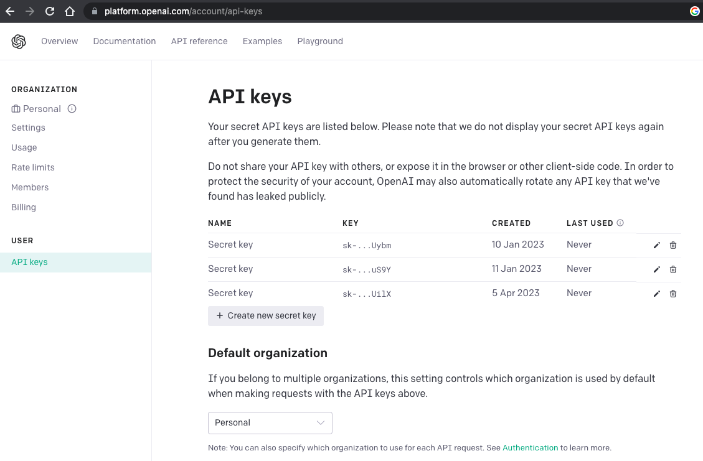
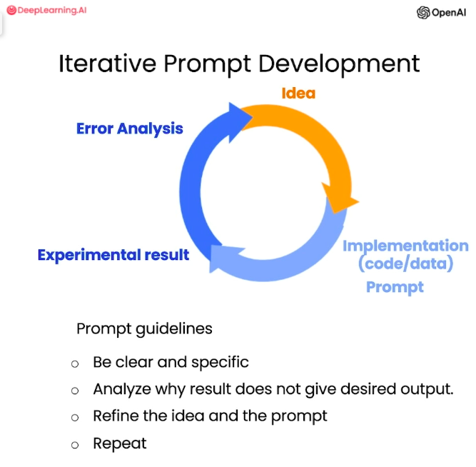

# 1. Prompt Engineering Guide

Welcome to the Prompt Engineering Guide, a collaborative project by OpenAI and DeepLearning AI! This guide aims to provide you with comprehensive instructions and examples for prompt engineering, a crucial aspect of training and fine-tuning language models like GPT-3.5.

## 1.1. Table of Contents

- [1. Prompt Engineering Guide](#1-prompt-engineering-guide)
  - [1.1. Table of Contents](#11-table-of-contents)
  - [1.2. Introduction](#12-introduction)
  - [1.3. Getting Started](#13-getting-started)
  - [1.4. Overview](#14-overview)
  - [1.5. Jupyter Notebook](#15-jupyter-notebook)
  - [1.6. Guidelines for Prompting](#16-guidelines-for-prompting)
    - [**1.6.1. Principle**: Write clear and specific instructions](#161-principle-write-clear-and-specific-instructions)
    - [**1.6.2. Principle:** Give the model time to “think”](#162-principle-give-the-model-time-to-think)
  - [1.7. Iterative Prompt Development](#17-iterative-prompt-development)
    - [Issue 1: The text is too long](#issue-1-the-text-is-too-long)
    - [Issue 2. Text focuses on the wrong details](#issue-2-text-focuses-on-the-wrong-details)
    - [Issue 3. Description needs a table of dimensions](#issue-3-description-needs-a-table-of-dimensions)
  - [1.8. Summarizing](#18-summarizing)
    - [Example 1: Text to summarize](#example-1-text-to-summarize)
    - [Summarize with a word/sentence/character limit](#summarize-with-a-wordsentencecharacter-limit)
    - [Summarize with a focus on shipping and delivery](#summarize-with-a-focus-on-shipping-and-delivery)
    - [Summarize with a focus on price and value](#summarize-with-a-focus-on-price-and-value)
    - [Try "extract" instead of "summarize"](#try-extract-instead-of-summarize)
    - [Summarize multiple product reviews](#summarize-multiple-product-reviews)
  - [1.9. Infering](#19-infering)
    - [Product review text](#product-review-text)
    - [Identify types of emotions](#identify-types-of-emotions)
    - [Identify anger](#identify-anger)
    - [Extract product and company name from customer reviews](#extract-product-and-company-name-from-customer-reviews)
    - [Doing multiple tasks at once](#doing-multiple-tasks-at-once)
    - [Inferring topics](#inferring-topics)
    - [Infer 5 topics](#infer-5-topics)
    - [Make a news alert for certain topics](#make-a-news-alert-for-certain-topics)
  - [1.10. Transforming](#110-transforming)
  - [1.11. Expanding](#111-expanding)
  - [1.12. Chatbot](#112-chatbot)
  - [1.13. Extending the Course](#113-extending-the-course)
  - [1.14. Contributing](#114-contributing)
  - [1.15. More Resources](#115-more-resources)

## 1.2. Introduction

The field of natural language processing has witnessed significant advancements in recent years, with language models such as GPT-3.5 achieving remarkable performance. However, to leverage the full potential of these models, effective prompt engineering is essential. Prompts are the input instructions given to the model, and crafting them carefully can greatly enhance the quality and relevance of the generated output.

## 1.3. Getting Started
This guide requires a basic understanding of Python and Jupyter Notebook.
You need to signup at [OpenAI](https://platform.openai.com/) and generate API key as shown below.
<!-- Get image from img folder -->


To get started with the Prompt Engineering Guide, follow the instructions below.

1. Clone the repository: `git clone https://github.com/Aarif1430/PromptGenius.git`
2. Install the required dependencies: `pip install openai`
3. Launch Jupyter Notebook: `jupyter notebook`
4. Open the **Prompt_Engineering_Guide.ipynb** notebook.
5. Follow along with the lessons and examples provided.

## 1.4. Overview

The Prompt Engineering Guide by [OpenAI](https://openai.com/) and [DeepLearning AI](https://deeplearning.ai/) is designed as a comprehensive course that covers various aspects of prompt engineering. It provides step-by-step instructions, best practices, and real-world examples to help you craft effective prompts for your language models.

The course is organized into the following sections:

1. **[Guidelines for Prompting](#16-guidelines-for-prompting):**: Learn the fundamentals of prompt engineering and how to apply them.
2. **[Iterative Prompt Development](#17-iterative-prompt-development):** This section covers the iterative process of developing prompts and fine-tuning them to achieve the desired results
3. **[Summarizing](#18-summarizing):** Learn how to use prompts to generate summaries of text. You will summarize text with a focus on specific topics and keywords.
4. **[Infering](#19-infering):** Learn how to use prompts to generate inferences from text. You will infer sentiments and topics from product reviews and news articles.
5. **[Transforming](#110-transforming):** Learn how to use prompts to transform text. You will learn how to use Large Language Models for tasks such as translation, spelling and grammar checking, tone adjustment, and format conversion.

6. **[Expanding](#111-expanding):** Learn how to use prompts to expand text. You will learn how to use Large Language Models to generate customer service emails that are relevant to the customer's query.
7. **[Chatbot](#112-chatbot):** Learn how to utilize the chat format to have extended conversations with LLM personalized or specific to a topic.

Each section includes theoretical explanations, practical examples, and coding exercises to reinforce your understanding.

## 1.5. Jupyter Notebook

The Prompt Engineering Guide is presented in the form of a Jupyter Notebook, providing an interactive learning environment. Jupyter Notebook allows you to run code cells, modify examples, and experiment with different prompt engineering techniques.

The notebook is structured in a logical sequence, making it easy to follow along. Each section includes detailed explanations, code snippets, and visualizations to enhance your learning experience.

## 1.6. Guidelines for Prompting
  In the section, guidelines for effective prompting are presented. The first principle is to write clear and specific instructions, using delimiters to indicate distinct parts of the input. Examples are shown, such as summarizing text and generating structured output. The second principle is to give the model time to think and avoid rushing to incorrect conclusions. Tactics include specifying steps for completing a task, instructing the model to reason out its own solution, and comparing solutions to evaluate correctness. Examples are provided for math problem evaluation.
  ### **1.6.1. Principle**: Write clear and specific instructions
  - Example 1:
              - **Use delimiters to clearly indicate distinct parts of the input.**
              - **Delimiters can be anything like:** ```, """, < >, <tag> </tag>,:


      ``` python
      text = f"""
      You should express what you want a model to do by providing instructions that are as clear and \
      specific as you can possibly make them. This will guide the model towards the desired output, \
      and reduce the chances of receiving irrelevant or incorrect responses. Don't confuse writing a \
      clear prompt with writing a short prompt. In many cases, longer prompts provide more clarity \
      and context for the model, which can lead to more detailed and relevant outputs.
      """
      prompt = f"""
      Summarize the text delimited by triple backticks into a single sentence.
      ```{text}```
      """

      response = get_completion(prompt)
      print(response)
      ```
      Output:
      ```bash
      Clear and specific instructions should be provided to guide a model towards the desired output, and longer prompts can provide more clarity and context for the model, leading to more detailed and relevant outputs.

      ```

  - Example 2:
              - **Ask for a strucured output.**
              - **JOSN, HTML, Python, etc.**:


      ``` python
      prompt = f"""
      Generate a list of three made-up book titles along with their authors and genres.
      Provide them in JSON format with the following keys:
      book_id, title, author, genre.
      """
      response = get_completion(prompt)
      print(response)
      ```
      Output:
      ```bash
      [
      {
        "book_id": 1,
        "title": "The Lost City of Zorath",
        "author": "Aria Blackwood",
        "genre": "Fantasy"
      },
      {
        "book_id": 2,
        "title": "The Last Survivors",
        "author": "Ethan Stone",
        "genre": "Science Fiction"
      },
      {
        "book_id": 3,
        "title": "The Secret of the Haunted Mansion",
        "author": "Lila Rose",
        "genre": "Mystery"
      }
    ]

      ```

  - Example 3: Ask the model to check whether conditions are satisfied
      ``` python
      text_1 = f"""
      Making a cup of tea is easy! First, you need to get some water boiling. While that's happening, \
      grab a cup and put a tea bag in it. Once the water is hot enough, just pour it over the tea bag. \
      Let it sit for a bit so the tea can steep. After a few minutes, take out the tea bag. If you \
      like, you can add some sugar or milk to taste. And that's it! You've got yourself a delicious \
      cup of tea to enjoy.
      """
      prompt = f"""
      You will be provided with text delimited by triple quotes.
      If it contains a sequence of instructions, re-write those instructions in the following format:

      Step 1 - ...
      Step 2 - …
      …
      Step N - …

      If the text does not contain a sequence of instructions, then simply write \"No steps provided.\"

      \"\"\"{text_1}\"\"\"
      """
      response = get_completion(prompt)
      print("Completion for Text 1:")
      print(response)
      ```
      Output:
      ```bash
      Completion for Text 1:
      Step 1 - Get some water boiling.
      Step 2 - Grab a cup and put a tea bag in it.
      Step 3 - Once the water is hot enough, pour it over the tea bag.
      Step 4 - Let it sit for a bit so the tea can steep.
      Step 5 - After a few minutes, take out the tea bag.
      Step 6 - Add some sugar or milk to taste.
      Step 7 - Enjoy your delicious cup of tea!

      ```
      - Below is the same prompt with a different text input. The model is able to correctly identify that the text does not contain a sequence of instructions.
      ``` python
      text_2 = f"""
      The sun is shining brightly today, and the birds are singing. It's a beautiful day to go for a \
      walk in the park. The flowers are blooming, and the trees are swaying gently in the breeze. People \
      are out and about, enjoying the lovely weather. Some are having picnics, while others are playing \
      games or simply relaxing on the grass. It's a perfect day to spend time outdoors and appreciate the \
      beauty of nature.
      """
      prompt = f"""
      You will be provided with text delimited by triple quotes.
      If it contains a sequence of instructions, re-write those instructions in the following format:

      Step 1 - ...
      Step 2 - …
      …
      Step N - …

      If the text does not contain a sequence of instructions, \
      then simply write \"No steps provided.\"

      \"\"\"{text_2}\"\"\"
      """
      response = get_completion(prompt)
      print("Completion for Text 2:")
      print(response)
      ```
      Output:
      ```
      Completion for Text 2:
      No steps provided.
      ```

  - Example 4: **Few Shot Prompting**

      Although large language models exhibit impressive zero-shot capabilities, they have limitations when it comes to handling complex tasks using the zero-shot setting. To overcome this, few-shot prompting can be employed as a technique to facilitate in-context learning. By including demonstrations within the prompt, we guide the model towards improved performance. These demonstrations act as a form of conditioning for subsequent examples, where we expect the model to generate a response. [Source](https://www.promptingguide.ai/techniques/fewshot)
      ``` python
      prompt = f"""
      Your task is to answer in a consistent style.

      <child>: Teach me about patience.

      <grandparent>: The river that carves the deepest valley flows from a modest spring; the \
      grandest symphony originates from a single note; the most intricate tapestry begins with a solitary thread.

      <child>: Teach me about resilience.
      """
      response = get_completion(prompt)
      print(response)
      ```
      Output:
      ```bash
      <grandparent>: Resilience is like a tree that bends with the wind but never breaks. It is the ability to bounce back from adversity and overcome challenges. Just like a tree needs strong roots to withstand the storm, we need to cultivate inner strength and perseverance to be resilient.
      ```
### **1.6.2. Principle:** Give the model time to “think”
  - Example 1: Specify the steps required to complete a task
  ``` python
      text = f"""
    In a charming village, siblings Jack and Jill set out on a quest to fetch water from a hilltop \
    well. As they climbed, singing joyfully, misfortune struck—Jack tripped on a stone and tumbled \
    down the hill, with Jill following suit. Though slightly battered, the pair returned home to \
    comforting embraces. Despite the mishap, their adventurous spirits remained undimmed, and they \
    continued exploring with delight.
    """
    # example 1
    prompt_1 = f"""
    Perform the following actions:
    1 - Summarize the following text delimited by triple backticks with 1 sentence.
    2 - Translate the summary into French.
    3 - List each name in the French summary.
    4 - Output a json object that contains the following \
    keys: french_summary, num_names.

    Separate your answers with line breaks.

    Text:
    ```{text}```
    """
    response = get_completion(prompt_1)
    print("Completion for prompt 1:")
    print(response)
  ```
  Output:
  ```bash
    Completion for prompt 1:
  Two siblings, Jack and Jill, go on a quest to fetch water from a hilltop well, but misfortune strikes when Jack trips and tumbles down the hill, with Jill following suit, yet they return home slightly battered but with their adventurous spirits undimmed.

  Deux frères et sœurs, Jack et Jill, partent en quête d'eau d'un puits au sommet d'une colline, mais un malheur survient lorsque Jack trébuche et dévale la colline, suivi de Jill, mais ils rentrent chez eux légèrement meurtris mais avec leur esprit d'aventure intact.

  Jack, Jill.

  {
    "french_summary": "Deux frères et sœurs, Jack et Jill, partent en quête d'eau d'un puits au sommet d'une colline, mais un malheur survient lorsque Jack trébuche et dévale la colline, suivi de Jill, mais ils rentrent chez eux légèrement meurtris mais avec leur esprit d'aventure intact.",
    "num_names": 2
  }
  ```

  - Example 2: Instruct the model to work out its own solution before rushing to a conclusion
  ``` python
      prompt = f"""
      Determine if the student's solution is correct or not.

      Question:
      I'm building a solar power installation and I need help working out the financials.
      - Land costs $100 / square foot
      - I can buy solar panels for $250 / square foot
      - I negotiated a contract for maintenance that will cost me a flat $100k per year, and an additional $10 / square \
      foot
      What is the total cost for the first year of operations
      as a function of the number of square feet.

      Student's Solution:
      Let x be the size of the installation in square feet.
      Costs:
      1. Land cost: 100x
      2. Solar panel cost: 250x
      3. Maintenance cost: 100,000 + 100x
      Total cost: 100x + 250x + 100,000 + 100x = 450x + 100,000
      """
      response = get_completion(prompt)
      print(response)
  ```
  Output:
  ```bash
  The student's solution is correct.
  ```
  The output is incorrect, as the student's solution is not correct. To fix this, we will instruct the model to work out its own solution.
  - Example 2 (Correct Prompt):
  ```python
  prompt = f"""
    Your task is to determine if the student's solution is correct or not.
    To solve the problem do the following:
    - First, work out your own solution to the problem.
    - Then compare your solution to the student's solution and evaluate if the student's solution is correct or not.
    Don't decide if the student's solution is correct until you have done the problem yourself.

    Use the following format:
    Question:
    ```
    question here
    ```
    Student's solution:
    ```
    student's solution here
    ```
    Actual solution:
    ```
    steps to work out the solution and your solution here
    ```
    Is the student's solution the same as actual solution \
    just calculated:
    ```
    yes or no
    ```
    Student grade:
    ```
    correct or incorrect
    ```

    Question:
    ```
    I'm building a solar power installation and I need help working out the financials.
    - Land costs $100 / square foot
    - I can buy solar panels for $250 / square foot
    - I negotiated a contract for maintenance that will cost me a flat $100k per year, and an additional $10 / square \
    foot
    What is the total cost for the first year of operations as a function of the number of square feet.
    ```
    Student's solution:
    ```
    Let x be the size of the installation in square feet.
    Costs:
    1. Land cost: 100x
    2. Solar panel cost: 250x
    3. Maintenance cost: 100,000 + 100x
    Total cost: 100x + 250x + 100,000 + 100x = 450x + 100,000
    ```
    Actual solution:
    """
    response = get_completion(prompt)
    print(response)
  ```
  Output:
  ```bash
  Steps to work out the solution and your solution here:
  Let x be the size of the installation in square feet.
  Costs:
  1. Land cost: 100x
  2. Solar panel cost: 250x
  3. Maintenance cost: 100,000 + 10x
  Total cost: 100x + 250x + 100,000 + 10x = 360x + 100,000

  The student's solution is incorrect because they added the maintenance cost twice.

  Is the student's solution the same as actual solution just calculated:
  no

  Student grade:
  incorrect
  ```


## 1.7. Iterative Prompt Development
The section discusses the iterative process of prompt development for large language models. It emphasizes the importance of refining prompts to achieve desired results. Various examples are provided, including a shorter product description, a technical description for furniture retailers, and even a complex prompt instructing the model to generate HTML-formatted content. The iterative approach and the role of effective prompt engineering are highlighted. The section concludes by mentioning the potential use of prompts with multiple examples and evaluating prompts against a larger set of cases for more mature applications.



- Example 1: Generate a marketing product description from a product fact sheet

  ```python
    fact_sheet_chair = """
    OVERVIEW
    - Part of a beautiful family of mid-century inspired office furniture,
    including filing cabinets, desks, bookcases, meeting tables, and more.
    - Several options of shell color and base finishes.
    - Available with plastic back and front upholstery (SWC-100)
    or full upholstery (SWC-110) in 10 fabric and 6 leather options.
    - Base finish options are: stainless steel, matte black,
    gloss white, or chrome.
    - Chair is available with or without armrests.
    - Suitable for home or business settings.
    - Qualified for contract use.

    CONSTRUCTION
    - 5-wheel plastic coated aluminum base.
    - Pneumatic chair adjust for easy raise/lower action.

    DIMENSIONS
    - WIDTH 53 CM | 20.87”
    - DEPTH 51 CM | 20.08”
    - HEIGHT 80 CM | 31.50”
    - SEAT HEIGHT 44 CM | 17.32”
    - SEAT DEPTH 41 CM | 16.14”

    OPTIONS
    - Soft or hard-floor caster options.
    - Two choices of seat foam densities:
    medium (1.8 lb/ft3) or high (2.8 lb/ft3)
    - Armless or 8 position PU armrests

    MATERIALS
    SHELL BASE GLIDER
    - Cast Aluminum with modified nylon PA6/PA66 coating.
    - Shell thickness: 10 mm.
    SEAT
    - HD36 foam

    COUNTRY OF ORIGIN
    - Italy
    """

    prompt = f"""
    Your task is to help a marketing team create a
    description for a retail website of a product based
    on a technical fact sheet.

    Write a product description based on the information
    provided in the technical specifications delimited by
    triple backticks.

    Technical specifications: ```{fact_sheet_chair}```
    """
    response = get_completion(prompt)
    print(response)
  ```

Oupput:
  ```bash
  Introducing our stunning mid-century inspired office chair, the perfect addition to any home or business setting. Part of a beautiful family of office furniture, including filing cabinets, desks, bookcases, meeting tables, and more, this chair is available in several options of shell color and base finishes to suit your style. Choose from plastic back and front upholstery (SWC-100) or full upholstery (SWC-110) in 10 fabric and 6 leather options.

  The chair is constructed with a 5-wheel plastic coated aluminum base and features a pneumatic chair adjust for easy raise/lower action. It is available with or without armrests and is qualified for contract use. The base finish options are stainless steel, matte black, gloss white, or chrome.

  Measuring at a width of 53 cm, depth of 51 cm, and height of 80 cm, with a seat height of 44 cm and seat depth of 41 cm, this chair is designed for ultimate comfort. You can also choose between soft or hard-floor caster options and two choices of seat foam densities: medium (1.8 lb/ft3) or high (2.8 lb/ft3). The armrests are available in either an armless or 8 position PU option.

  The materials used in the construction of this chair are of the highest quality. The shell base glider is made of cast aluminum with modified nylon PA6/PA66 coating and has a shell thickness of 10 mm. The seat is made of HD36 foam, ensuring maximum comfort and durability.

  This chair is made in Italy and is the perfect combination of style and functionality. Upgrade your workspace with our mid-century inspired office chair today!
```
### Issue 1: The text is too long
- Limit the number of words/sentences/characters.
```python
  prompt = f"""
  Your task is to help a marketing team create a
  description for a retail website of a product based
  on a technical fact sheet.

  Write a product description based on the information
  provided in the technical specifications delimited by
  triple backticks.

  Use at most 50 words.

  Technical specifications: ```{fact_sheet_chair}```
  """
  response = get_completion(prompt)
  print(response)
```

Output:
```bash
Introducing our mid-century inspired office chair, perfect for home or business settings. Available in a range of shell colors and base finishes, with or without armrests. Choose from 10 fabric and 6 leather options for full or plastic upholstery. With a 5-wheel base and pneumatic chair adjust, it's both stylish and functional. Made in Italy.
```

### Issue 2. Text focuses on the wrong details
- Ask it to focus on the aspects that are relevant to the intended audience.

```python
  prompt = f"""
  Your task is to help a marketing team create a
  description for a retail website of a product based
  on a technical fact sheet.

  Write a product description based on the information
  provided in the technical specifications delimited by
  triple backticks.

  The description is intended for furniture retailers,
  so should be technical in nature and focus on the
  materials the product is constructed from.

  Use at most 50 words.

  Technical specifications: ```{fact_sheet_chair}```
  """
  response = get_completion(prompt)
  print(response)

```
Output:
```bash
Introducing our mid-century inspired office chair, perfect for both home and business settings. With a range of shell colors and base finishes, including stainless steel and matte black, this chair is available with or without armrests. The 5-wheel plastic coated aluminum base and pneumatic chair adjust make it easy to move and adjust to your desired height. Made with high-quality materials, including a cast aluminum shell and HD36 foam seat, this chair is built to last.
```

### Issue 3. Description needs a table of dimensions
- Ask it to extract information and organize it in a table.
```python
  prompt = f"""
  Your task is to help a marketing team create a
  description for a retail website of a product based
  on a technical fact sheet.

  Write a product description based on the information
  provided in the technical specifications delimited by
  triple backticks.

  The description is intended for furniture retailers,
  so should be technical in nature and focus on the
  materials the product is constructed from.

  At the end of the description, include every 7-character
  Product ID in the technical specification.

  After the description, include a table that gives the
  product's dimensions. The table should have two columns.
  In the first column include the name of the dimension.
  In the second column include the measurements in inches only.

  Give the table the title 'Product Dimensions'.

  Format everything as HTML that can be used in a website.
  Place the description in a <div> element.

  Technical specifications: ```{fact_sheet_chair}```
  """

  response = get_completion(prompt)
  print(response)
```
Output:

`
<div>\n<h2>Mid-Century Inspired Office Chair<h2>\n<p>Introducing our mid-century inspired office chair, part of a beautiful family of office furniture that includes filing cabinets, desks, bookcases, meeting tables, and more. This chair is available in several options of shell color and base finishes, allowing you to customize it to your liking. You can choose between plastic back and front upholstery or full upholstery in 10 fabric and 6 leather options. The base finish options are stainless steel, matte black, gloss white, or chrome. The chair is also available with or without armrests, making it suitable for both home and business settings. Plus, it\'s qualified for contract use, so you can trust its durability and quality.</p>\n<h3>Construction</h3>\n<p>The chair features a 5-wheel plastic coated aluminum base and a pneumatic chair adjust for easy raise/lower action. You can choose between soft or hard-floor caster options and two choices of seat foam densities: medium (1.8 lb/ft3) or high (2.8 lb/ft3). The chair is also available with armless or 8 position PU armrests.</p>\n<h3>Materials</h3>\n<p>The shell base glider is made of cast aluminum with modified nylon PA6/PA66 coating, and the shell thickness is 10 mm. The seat is made of HD36 foam, ensuring comfort and support.</p>\n<h3>Product Dimensions</h3>\n<table>\n  <tr>\n    <td>Width</td>\n    <td>53 cm | 20.87"</td>\n  </tr>\n  <tr>\n    <td>Depth</td>\n    <td>51 cm | 20.08"</td>\n  </tr>\n  <tr>\n    <td>Height</td>\n    <td>80 cm | 31.50"</td>\n  </tr>\n  <tr>\n    <td>Seat Height</td>\n    <td>44 cm | 17.32"</td>\n  </tr>\n  <tr>\n    <td>Seat Depth</td>\n    <td>41 cm | 16.14"</td>\n  </tr>\n</table>\n<h3>Product ID</h3>\n<p>SWC-100, SWC-110</p>\n</div>`

## 1.8. Summarizing

### Example 1: Text to summarize
```python
prod_review = """
Got this panda plush toy for my daughter's birthday, \
who loves it and takes it everywhere. It's soft and \
super cute, and its face has a friendly look. It's \
a bit small for what I paid though. I think there \
might be other options that are bigger for the \
same price. It arrived a day earlier than expected, \
so I got to play with it myself before I gave it \
to her.
"""
```
### Summarize with a word/sentence/character limit
```python
  prompt = f"""
  Your task is to generate a short summary of a product \
  review from an ecommerce site.

  Summarize the review below, delimited by triple
  backticks, in at most 30 words.

  Review: ```{prod_review}```
  """

  response = get_completion(prompt)
  print(response)
```
Output:
```bash
Soft and cute panda plush toy loved by daughter, but a bit small for the price. Arrived early.
```

### Summarize with a focus on shipping and delivery
```python
  prompt = f"""
  Your task is to generate a short summary of a product \
  review from an ecommerce site to give feedback to the \
  Shipping deparmtment.

  Summarize the review below, delimited by triple
  backticks, in at most 30 words, and focusing on any aspects \
  that mention shipping and delivery of the product.

  Review: ```{prod_review}```
  """

  response = get_completion(prompt)
  print(response)

```
Output:
```bash
The panda plush toy arrived a day earlier than expected, but the customer felt it was a bit small for the price paid.
```

### Summarize with a focus on price and value
```python
prompt = f"""
Your task is to generate a short summary of a product \
review from an ecommerce site to give feedback to the \
pricing deparmtment, responsible for determining the \
price of the product.

Summarize the review below, delimited by triple
backticks, in at most 30 words, and focusing on any aspects \
that are relevant to the price and perceived value.

Review: ```{prod_review}```
"""

response = get_completion(prompt)
print(response)
```
Output:
```bash
The panda plush toy is soft, cute, and loved by the recipient, but the price may be too high for its size compared to other options.
```

### Try "extract" instead of "summarize"
```python
prompt = f"""
Your task is to extract relevant information from \
a product review from an ecommerce site to give \
feedback to the Shipping department.

From the review below, delimited by triple quotes \
extract the information relevant to shipping and \
delivery. Limit to 30 words.

Review: ```{prod_review}```
"""

response = get_completion(prompt)
print(response)
```
Output:
```bash
The product arrived a day earlier than expected.
```

### Summarize multiple product reviews
```python
review_1 = prod_review

# review for a standing lamp
review_2 = """
Needed a nice lamp for my bedroom, and this one \
had additional storage and not too high of a price \
point. Got it fast - arrived in 2 days. The string \
to the lamp broke during the transit and the company \
happily sent over a new one. Came within a few days \
as well. It was easy to put together. Then I had a \
missing part, so I contacted their support and they \
very quickly got me the missing piece! Seems to me \
to be a great company that cares about their customers \
and products.
"""

# review for an electric toothbrush
review_3 = """
My dental hygienist recommended an electric toothbrush, \
which is why I got this. The battery life seems to be \
pretty impressive so far. After initial charging and \
leaving the charger plugged in for the first week to \
condition the battery, I've unplugged the charger and \
been using it for twice daily brushing for the last \
3 weeks all on the same charge. But the toothbrush head \
is too small. I’ve seen baby toothbrushes bigger than \
this one. I wish the head was bigger with different \
length bristles to get between teeth better because \
this one doesn’t.  Overall if you can get this one \
around the $50 mark, it's a good deal. The manufactuer's \
replacements heads are pretty expensive, but you can \
get generic ones that're more reasonably priced. This \
toothbrush makes me feel like I've been to the dentist \
every day. My teeth feel sparkly clean!
"""

# review for a blender
review_4 = """
So, they still had the 17 piece system on seasonal \
sale for around $49 in the month of November, about \
half off, but for some reason (call it price gouging) \
around the second week of December the prices all went \
up to about anywhere from between $70-$89 for the same \
system. And the 11 piece system went up around $10 or \
so in price also from the earlier sale price of $29. \
So it looks okay, but if you look at the base, the part \
where the blade locks into place doesn’t look as good \
as in previous editions from a few years ago, but I \
plan to be very gentle with it (example, I crush \
very hard items like beans, ice, rice, etc. in the \
blender first then pulverize them in the serving size \
I want in the blender then switch to the whipping \
blade for a finer flour, and use the cross cutting blade \
first when making smoothies, then use the flat blade \
if I need them finer/less pulpy). Special tip when making \
smoothies, finely cut and freeze the fruits and \
vegetables (if using spinach-lightly stew soften the \
spinach then freeze until ready for use-and if making \
sorbet, use a small to medium sized food processor) \
that you plan to use that way you can avoid adding so \
much ice if at all-when making your smoothie. \
After about a year, the motor was making a funny noise. \
I called customer service but the warranty expired \
already, so I had to buy another one. FYI: The overall \
quality has gone done in these types of products, so \
they are kind of counting on brand recognition and \
consumer loyalty to maintain sales. Got it in about \
two days.
"""

reviews = [review_1, review_2, review_3, review_4]
```

  ```python
  for i in range(len(reviews)):
    prompt = f"""
    Your task is to generate a short summary of a product \
    review from an ecommerce site.

    Summarize the review below, delimited by triple \
    backticks in at most 20 words.

    Review: ```{reviews[i]}```
    """

    response = get_completion(prompt)
    print(i, response, "\n")
  ```
Output:
```bash
0 Soft and cute panda plush toy loved by daughter, but a bit small for the price. Arrived early.

1 Affordable lamp with storage, fast shipping, and excellent customer service. Easy to assemble and missing parts were quickly replaced.

2 Good battery life, small toothbrush head, but effective cleaning. Good deal if bought around $50.

3 The product was on sale for $49 in November, but the price increased to $70-$89 in December. The base doesn't look as good as previous editions, but the reviewer plans to be gentle with it. A special tip for making smoothies is to freeze the fruits and vegetables beforehand. The motor made a funny noise after a year, and the warranty had expired. Overall quality has decreased.
```

## 1.9. Infering

## Product review text
```python
lamp_review = """
Needed a nice lamp for my bedroom, and this one had \
additional storage and not too high of a price point. \
Got it fast.  The string to our lamp broke during the \
transit and the company happily sent over a new one. \
Came within a few days as well. It was easy to put \
together.  I had a missing part, so I contacted their \
support and they very quickly got me the missing piece! \
Lumina seems to me to be a great company that cares \
about their customers and products!!
"""
```
```python
prompt = f"""
What is the sentiment of the following product review,
which is delimited with triple backticks?

Give your answer as a single word, either "positive" \
or "negative".

Review text: '''{lamp_review}'''
"""
response = get_completion(prompt)
print(response)
```
Output:
```bash
The sentiment of the product review is positive.
```
## Identify types of emotions
```python
prompt = f"""
Identify a list of emotions that the writer of the \
following review is expressing. Include no more than \
five items in the list. Format your answer as a list of \
lower-case words separated by commas.

Review text: '''{lamp_review}'''
"""
response = get_completion(prompt)
print(response)
```
Output:
```bash
  happy, satisfied, grateful, impressed, content
```

## Identify anger
```python
prompt = f"""
Is the writer of the following review expressing anger?\
The review is delimited with triple backticks. \
Give your answer as either yes or no.

Review text: '''{lamp_review}'''
"""
response = get_completion(prompt)
print(response)
```
Output:
```bash
No
```

## Extract product and company name from customer reviews
```python
prompt = f"""
Identify the following items from the review text:
- Item purchased by reviewer
- Company that made the item

The review is delimited with triple backticks. \
Format your response as a JSON object with \
"Item" and "Brand" as the keys.
If the information isn't present, use "unknown" \
as the value.
Make your response as short as possible.

Review text: '''{lamp_review}'''
"""
response = get_completion(prompt)
print(response)
```
Output:
```bash
{
  "Item": "lamp",
  "Brand": "Lumina"
}
```

## Doing multiple tasks at once
```python
prompt = f"""
Identify the following items from the review text:
- Sentiment (positive or negative)
- Is the reviewer expressing anger? (true or false)
- Item purchased by reviewer
- Company that made the item

The review is delimited with triple backticks. \
Format your response as a JSON object with \
"Sentiment", "Anger", "Item" and "Brand" as the keys.
If the information isn't present, use "unknown" \
as the value.
Make your response as short as possible.
Format the Anger value as a boolean.

Review text: '''{lamp_review}'''
"""
response = get_completion(prompt)
print(response)
```
Output:
```bash
{
  "Sentiment": "positive",
  "Anger": false,
  "Item": "lamp",
  "Brand": "Lumina"
}
```
## Inferring topics

```python
story = """
In a recent survey conducted by the government,
public sector employees were asked to rate their level
of satisfaction with the department they work at.
The results revealed that NASA was the most popular
department with a satisfaction rating of 95%.

One NASA employee, John Smith, commented on the findings,
stating, "I'm not surprised that NASA came out on top.
It's a great place to work with amazing people and
incredible opportunities. I'm proud to be a part of
such an innovative organization."

The results were also welcomed by NASA's management team,
with Director Tom Johnson stating, "We are thrilled to
hear that our employees are satisfied with their work at NASA.
We have a talented and dedicated team who work tirelessly
to achieve our goals, and it's fantastic to see that their
hard work is paying off."

The survey also revealed that the
Social Security Administration had the lowest satisfaction
rating, with only 45% of employees indicating they were
satisfied with their job. The government has pledged to
address the concerns raised by employees in the survey and
work towards improving job satisfaction across all departments.
"""
```
## Infer 5 topics
```python
prompt = f"""
Determine five topics that are being discussed in the \
following text, which is delimited by triple backticks.

Make each item one or two words long.

Format your response as a list of items separated by commas.

Text sample: '''{story}'''
"""
response = get_completion(prompt)
print(response)
```
Output:
```bash
government survey, job satisfaction, NASA, Social Security Administration, employee concerns
```

## Make a news alert for certain topics
```python
topic_list = [
    "nasa", "local government", "engineering",
    "employee satisfaction", "federal government"
]
prompt = f"""
Determine whether each item in the following list of \
topics is a topic in the text below, which
is delimited with triple backticks.

Give your answer as list with 0 or 1 for each topic.\

List of topics: {", ".join(topic_list)}

Text sample: '''{story}'''
"""
response = get_completion(prompt)
print(response)
```
Output:
```bash
nasa: 1
local government: 0
engineering: 0
employee satisfaction: 1
federal government: 1
```

## 1.10. Transforming

## 1.11. Expanding

## 1.12. Chatbot


## 1.13. Extending the Course

Our aim is to continuously expand and enhance the Prompt Engineering Guide to encompass a wide range of topics and use cases. We encourage contributions from the community to help us achieve this goal.

If you have additional examples, case studies, or techniques that you would like to share, please feel free to submit a pull request. Together, we can create a comprehensive resource for prompt engineering that benefits the entire community.

## 1.14. Contributing

We appreciate your interest in contributing to the Prompt Engineering Guide. To contribute, please


## 1.15. More Resources
